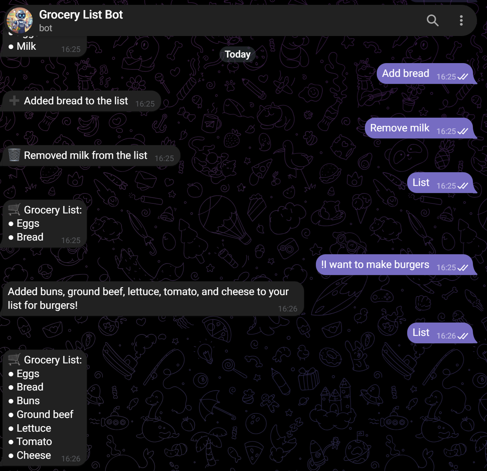
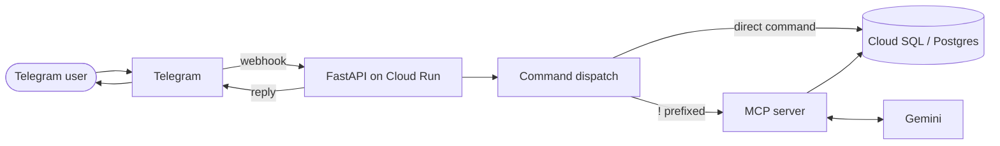

# AI Grocery List Manager

A Telegram bot that manages your grocery list — add and remove items directly, or just describe what you're cooking and let an LLM figure out what to add.



## How it works

Each Telegram chat gets its own grocery list, keyed by chat ID. Messages are handled in one of two ways:

- **Direct commands** — `add`, `remove`, `clear`, `list`, `help` are parsed and executed immediately, no LLM involved.
- **Natural language requests** — prefixing a message with `!` (or `$` / `#`) sends it to an LLM (Gemini), which can read and modify the list through a set of tools exposed over an MCP (Model Context Protocol) server. For example, `!I want to make burgers` lets the LLM decide to add buns, ground beef, lettuce, etc.



## Features

- Add, remove, clear, and list grocery items with plain commands
- Natural-language requests handled by an LLM with tool access to the list (via MCP)
- Multi-language support (English and Hebrew currently), driven entirely by a YAML config — no code changes needed to add new command words in a supported language
- Per-user lists, isolated by Telegram chat ID
- `/start` and `/help` responses that adapt to the language the user typed in

## Tech stack

- **FastAPI** + **Uvicorn** — webhook server
- **asyncpg** — async Postgres driver
- **Cloud SQL (Postgres)** — persistence
- **Cloud Run** — hosting
- **MCP (Model Context Protocol)** — exposes list operations as tools to the LLM
- **Gemini `gemini-3.1-flash-lite`** (`google-genai`) — natural-language request handling
- **PyYAML** — language/command configuration
- **pytest** — automated tests
- **Docker** — containerized deploys

## Architecture & design decisions

This project is primarily a learning exercise in applying OOP principles and common design patterns to a real, deployed service, so a few decisions are worth calling out:

- **`Command` class hierarchy** (`commands/`) — every request type (`ADD`, `REMOVE`, `CLEAR`, `HELP`, `START`, `SEND_TO_LLM`, …) is its own `Command` subclass implementing `handle()` and `format_reply()`. New command types are auto-discovered at import time and registered by their `REQUEST_TYPE`; `Command.__init_subclass__` enforces at class-definition time that every subclass declares a valid, unique request type, so a broken command fails fast instead of silently misrouting messages.
- **`MessageSource` strategy pattern** (`message_sources/`) — webhook signature verification and message extraction are abstracted behind a `MessageSource` interface, decoupling the shared dispatch logic (`process_message` in `main.py`) from Telegram specifically. Adding another platform (or a plain web frontend) later means implementing one new `MessageSource`, not touching the dispatch logic.
- **Data-driven, YAML-based language support** (`languages_config.yaml` + `language_yaml_parser.py`) — command words, prefixes, and descriptions per language live entirely in config, not in code. `/help` and `/start` responses read from the same parsed maps, so they can't drift out of sync with what's actually recognized.
- **Least-privilege IAM** — the Cloud Run service runs under a dedicated service account scoped to exactly what it needs (`cloudsql.client`, `secretmanager.secretAccessor` on specific secrets), rather than the default broad Compute Engine service account.

## Project structure

```
bot-process/
├── main.py                  # FastAPI app, webhook route, message dispatch
├── db.py                    # Postgres queries (asyncpg)
├── mcp_server.py            # MCP server exposing list operations as tools
├── telegram.py              # Outbound Telegram API calls
├── parsed_message.py        # Classifies an incoming message (request type + language)
├── language_yaml_parser.py  # Parses languages_config.yaml into lookup maps
├── languages_config.yaml    # All supported languages' command words/prefixes/descriptions
├── request_types.py         # RequestType enum
├── commands/                # One Command subclass per request type
├── message_sources/         # MessageSource strategy (currently: Telegram)
└── tests/                   # pytest suite
```

## Running locally

Requires the following environment variables:

| Variable | Purpose |
|---|---|
| `INSTANCE_CONNECTION_NAME` | Cloud SQL instance connection name |
| `DB_NAME` / `DB_USER` / `DB_PASSWORD` | Postgres credentials |
| `GEMINI_API_KEY` | Gemini API key for LLM requests |
| `BOT_TOKEN` | Telegram bot token, used to send replies |
| `TELEGRAM_WEBHOOK_SECRET` | Secret token Telegram includes on webhook calls, verified against `X-Telegram-Bot-Api-Secret-Token` |

You'll also need to register the webhook with Telegram (pointing it at your deployed `/webhook/telegram` endpoint) via the Telegram Bot API — this is a one-time setup call, not an env var.

```bash
pip install -r requirements.txt -r requirements-dev.txt
uvicorn main:app --reload
```

## Testing

```bash
pytest tests/ -v
```

Current coverage: command dispatch/registry integrity, language-aware message classification, and language-aware `/help` reply generation.

## Possible future work

- Additional languages (adding one is just a YAML edit, no code changes)
- A web frontend, enabled by the existing `MessageSource` abstraction
- Automated integration tests against a real Postgres instance
